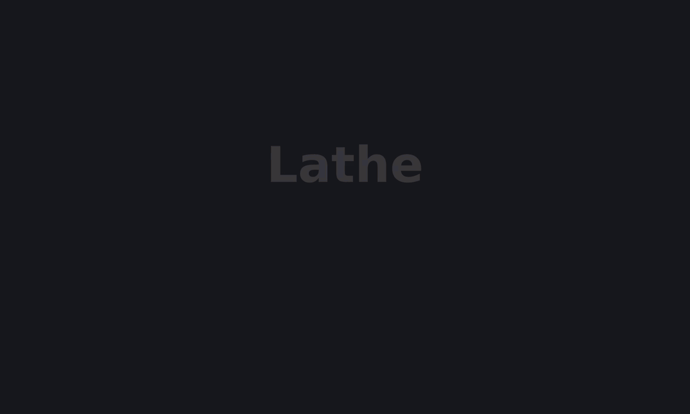

# Lathe

[](https://central.sonatype.com/artifact/io.github.ag-libs/lathe-maven-extension)
[](https://github.com/ag-libs/lathe/actions/workflows/ci.yml)

**A Java language server that works from your Maven build — no project import, no classpath setup.**

Lathe is a Java language server for Maven projects — code intelligence, diagnostics, and run, test, and
debug. It is built on the JDK's own Java compiler, so its analysis matches what `javac` sees.

If you've fought a Java LSP in your editor, the pain is usually project import and classpath or
module-path config drifting from the build. Lathe's project model comes straight from your actual Maven build: it
captures the exact configuration Maven compiles, tests, and runs with, and works from it directly — so
the setups that are hardest to get right in an editor tend to just work. This shows most on modular Java
projects: reactor type discovery, exported-package visibility, and module-aware completion follow your
module graph as the build defines it. Annotation processors and plugins that add source roots or change
how a module compiles are handled the same way.

Because the editor uses the build's own configuration, it stays in sync with it — diagnostics are what
the compiler reports, and runs and tests replay the real launch without a Maven rebuild.

Setup is one extension registration, a first build, and a plugin line in your Neovim config.

Lathe ships a [Neovim client](#editors) and an [MCP server for AI coding agents](#ai-agents-mcp); a
[VS Code client](#editors) is planned.

## Demo

A ~1-minute walkthrough — capture your Maven build's classpath once, then a zero-config Java IDE:
completion and live diagnostics, running a modular main, debugging with live expression eval, and
tests — all replayed from your build.



<!-- The GIF filename carries a content hash (docs/demo-<hash>.gif) so browsers never serve a stale
     cached copy: dev/demo/record.sh regenerates it, renames it by content hash, deletes the previous
     one, and rewrites the link above. Do not hand-edit the hash. Recorded against the public
     com.example multi-module fixture. -->

## Features

Lathe implements the standard LSP feature surface, plus run, test, and debug. Every capability is
available to any LSP client; see [Editors](#editors) for the client that drives them and its key
bindings.

### Code intelligence

| Feature                      | What it does                                                                                      | LSP method                                        |
|------------------------------|---------------------------------------------------------------------------------------------------|---------------------------------------------------|
| Go to definition             | jumps to local sources, unpacked dependency JAR sources, and JDK sources                          | `textDocument/definition`                         |
| Go to declaration            | navigates to the overridden interface or abstract-method contract                                 | `textDocument/declaration`                        |
| Implementation / subtypes    | concrete implementations of a method, or all subtypes of a type across the workspace              | `textDocument/implementation`                     |
| Find references              | usages across the workspace                                                                       | `textDocument/references`                         |
| Highlight uses               | read/write uses of the symbol under the cursor, within the current file                          | `textDocument/documentHighlight`                  |
| Rename                       | renames locals, parameters, type parameters, fields, methods (incl. the override family), record components, and constructors, and every reference **across the whole reactor — all modules** — as one atomic edit | `textDocument/rename` · `textDocument/prepareRename` |
| Instantiation sites          | where a type is instantiated (`new AppServer(...)`), from the type under the cursor               | `workspace/executeCommand` · `lathe.instantiations` |
| Hover                        | AST-resolved Javadoc, rendered as Markdown                                                        | `textDocument/hover`                              |
| Signature help               | parameter lists for methods and constructors                                                      | `textDocument/signatureHelp`                      |
| Completion                   | types, methods, and variables, with automatic import insertion                                    | `textDocument/completion`                         |
| Document / workspace symbols | file outline; workspace search with CamelCase-hump matching (`ASF` finds `AbstractServerFactory`) | `textDocument/documentSymbol`, `workspace/symbol` |
| Type hierarchy               | supertypes and subtypes of the symbol under the cursor, one level at a time                        | `textDocument/prepareTypeHierarchy`               |
| Full type hierarchy          | all transitive supertypes and subtypes of the type under the cursor at once, tagged by relation    | `workspace/executeCommand` · `lathe.typeHierarchy` |
| Add missing imports          | resolve every unimported type in the file in one pass — unambiguous names are added automatically, ambiguous ones prompt | `workspace/executeCommand` · `lathe.missingImports` |
| Call hierarchy               | incoming and outgoing calls of a method                                                           | `textDocument/prepareCallHierarchy`               |
| Semantic tokens              | highlights static/deprecated members, enum constants, type parameters, annotations                | `textDocument/semanticTokens/full`                |
| Folding                      | classes, methods, blocks, and import groups                                                       | `textDocument/foldingRange`                       |

### Diagnostics & formatting

| Feature             | What it does                                                                                 | LSP method                        |
|---------------------|----------------------------------------------------------------------------------------------|-----------------------------------|
| Diagnostics         | `javac` errors and warnings exactly as configured in Maven, plus unused private members and locals | `textDocument/publishDiagnostics` |
| Code actions        | import missing type · add all missing imports for the file · add `throws` clause · wrap with `try/catch` · declare local variable · replace `var` with the inferred type · extract variable / constant / field (incl. replace all occurrences) · stub a missing method | `textDocument/codeAction`         |
| Formatting (opt-in) | whole-document google-java-format with import cleanup — **off by default**                   | `textDocument/formatting`         |

Full-document formatting is **opt-in**: the server advertises `textDocument/formatting` only when a
client enables the `google` formatter, so Lathe never rewrites a project whose style contract isn't
Google Java Format. Live-editing indentation is a separate, always-on client concern — see the editor
guide to configure both.

### Run, test & debug

| Feature                                              | What it does                                                                                                                                                | LSP method                                                            |
|------------------------------------------------------|-------------------------------------------------------------------------------------------------------------------------------------------------------------|-----------------------------------------------------------------------|
| Run a `main`                                         | replays a `main` from captured `.lathe/` bytecode — no Maven rebuild, live output                                                           | `workspace/executeCommand` · `lathe.run.main`                         |
| Tests                                                | discovers and runs tests (method, class, or package) from `.lathe/` bytecode, with live output and a diagnostic on the failing assertion | `workspace/executeCommand` · `lathe.runnables.list`, `lathe.run.test` |
| Debug                                                | conditional breakpoints, stepping, variable inspection, and REPL expression evaluation over DAP                                                                         | `workspace/executeCommand` · `lathe.debug.*`, then DAP                |
| [Run configuration](docs/guide/run-configuration.md) | overlay JVM args, program args, environment, working directory, and class-/module-path per module                                                           | — (`lathe-run.json` overlays)                                         |

Run, test, and debug are Lathe extensions exposed through `workspace/executeCommand` (and the Debug
Adapter Protocol for debugging), not standard LSP methods.

### Scaffolding

| Feature  | What it does                                                                                                      | Command                                                   |
|----------|------------------------------------------------------------------------------------------------------------------|-----------------------------------------------------------|
| New type | scaffolds a `class` / `interface` / `record` / `enum` / `annotation` / `test`, plus `package-info` and `module-info` — pick the kind, fuzzy-pick the destination package, and name it; the server resolves placement, writes the file, and opens it | Neovim `:LatheNew` |

`:LatheNew <kind>` adds a type in the current file's package; run `:LatheNew` with no arguments for a
guided flow that fuzzy-picks the destination module and package. The server owns every Java/Maven
decision — module, source root, package, and skeleton. Full walkthrough in the
[Neovim cheatsheet](docs/guide/editors/neovim.md#create-a-new-type).

### Workspace freshness

Lathe keeps its model in step with your build. Open files are analysed live as you edit and save; when
sources or resources change **outside** the editor — a branch switch, a `git pull`, or an AI agent
editing files — Lathe detects it and offers to refresh. Changed resources are copied in without a
build.

## Editors

| Editor  | Status    | Reference                                                               |
|---------|-----------|-------------------------------------------------------------------------|
| Neovim  | Supported | [Neovim cheatsheet](docs/guide/editors/neovim.md) — install and keymaps |
| VS Code | Planned   | —                                                                       |

## AI agents (MCP)

Lathe also drives AI coding agents. The same build-derived engine that powers the editor is exposed
over the Model Context Protocol by `lathe-mcp-server`, so an agent gets javac-accurate, cross-module
code intelligence instead of guessing from `grep`: compiler-truth diagnostics, navigation that follows
into dependencies and generated sources, safe reactor-wide rename, and test replay without a Maven
build. Works with any MCP client — Claude Code, OpenAI Codex CLI, Gemini CLI.

Like the editor, it reads from a populated `.lathe/`, so run a build once first.

| Tool                   | What it does                                                         |
|------------------------|---------------------------------------------------------------------|
| `get_diagnostics`      | compiler errors/warnings for one file — no Maven                    |
| `get_definition`       | resolve a symbol to its definition, incl. dependencies/JDK/generated |
| `find_references`      | every real use of a symbol across the reactor                       |
| `find_implementations` | implementers of an interface / overrides of a method                |
| `call_hierarchy`       | callers or callees of a method, across modules                      |
| `search_symbols`       | find a type by name (CamelHumps) across reactor, dependencies, JDK   |
| `describe_symbol`      | signature, type, and javadoc for a symbol                           |
| `rename_symbol`        | rename a symbol across the whole reactor, applied to disk           |
| `run_test`             | replay a test / class / package from captured bytecode — no build   |

Full setup — registering with Claude Code, Codex, and Gemini, the result contract, and the freshness
model — is in the [AI agents guide](docs/guide/ai-agents.md).

## Requirements

- **Java 21+** — the same JDK your Maven build uses.
- **Maven 3.x**

Test run and debug have additional requirements (Surefire and JUnit Platform
versions); see [test-capture.md](docs/guide/test-capture.md).

## Setup

Set Lathe up once, in three steps.

**1. Register the Lathe extension** at your reactor root, as a Maven build extension — in
`.mvn/extensions.xml`, or in your root `pom.xml` under `<build><extensions>` (alongside any extensions
you already declare):

```xml
<extensions>
    <extension>
        <groupId>io.github.ag-libs</groupId>
        <artifactId>lathe-maven-extension</artifactId>
        <version>0.1.8</version>
    </extension>
</extensions>
```

See [installation.md](docs/guide/installation.md) for details.

**2. Generate the metadata once**, and add `.lathe/` to `.gitignore`:

```bash
mvn clean test -Dlathe.capture.only=true
```

This captures every launch template — compiler params, the workspace manifest, and each module's
run/test launch — without running your test suite. `-Dlathe.capture.only=true` forks each module to
snapshot its launch template but skips executing the tests; `clean` forces a first compile through
Lathe.

> **Tip:** the [Maven Daemon (`mvnd`)](https://github.com/apache/maven-mvnd) noticeably speeds up these
> builds — run it in place of `mvn` where you can.

> **Note:** if your build uses the Maven build cache extension, disable it for Lathe builds
> (`-Dmaven.build.cache.enabled=false`) — a cache hit skips compilation, so Lathe would not see the real
> build and its captured configuration would go stale.

**3. Add the Neovim client.** The build unpacks it into `~/.cache/lathe/current/neovim`; point your
plugin manager at that directory. With `lazy.nvim`:

```lua
{
  dir = vim.fn.expand("~/.cache/lathe/current/neovim"),  -- installed by the Lathe build
  ft = "java",
  cmd = "LatheStart",                             -- also start it from a non-Java buffer
  dependencies = { "mfussenegger/nvim-dap" },     -- optional: enables :LatheDebug
  config = function()
    require("lathe").setup()                       -- formatter/indent are opt-in; see the cheatsheet
    -- Lathe adds no maps of its own; a starting set for commands with no Neovim default:
    vim.keymap.set("n", "<leader>rr", "<cmd>LatheRun<cr>",          { desc = "Run main under cursor" })
    vim.keymap.set("n", "grN",        "<cmd>LatheInstances<cr>",     { desc = "Instantiation sites" })
    vim.keymap.set("n", "grh",        "<cmd>LatheTypeHierarchy<cr>", { desc = "Full type hierarchy" })
  end,
}
```

The `config` function calling `setup()` is required — without it the LSP server is never registered.
Standard LSP actions (go-to-definition, references, rename, …) use Neovim's built-in defaults, so they
work without extra maps. Full keymaps, formatting options, and the neotest test-runner integration are
in the [Neovim cheatsheet](docs/guide/editors/neovim.md). Requires Neovim 0.12+.

After that, it keeps up on its own: every Maven build (`mvn test`, `verify`, `install`) refreshes
Lathe's configuration, and the editor watches for changes made outside it. The added build cost is
marginal — Lathe runs your real `javac` and just records its parameters (plus a one-time resolve of
dependency and JDK sources). See
[what the build writes](docs/guide/installation.md#what-and-where-lathe-writes) for the details.

## How it works

Lathe has a few moving parts, each documented in depth. In brief — full mechanics in
[How Lathe works](docs/guide/how-it-works.md):

- **Build capture** — every build records the exact compiler configuration and mirrors your compiled
  classes into `.lathe/`, which the language server reads.
- **Dependency & JDK sources** — resolved and unpacked into `~/.cache/lathe/`, so go-to-definition steps
  into library and JDK code.
- **Test capture** — the test JVM is captured from inside your Surefire fork by live introspection and
  replayed against `.lathe/` without a Maven rebuild. [Details →](docs/guide/test-capture.md)
- **Run & debug** — runs and debug sessions replay the captured launch in a fresh JVM; customize it with
  an overlay. [Details →](docs/guide/run-configuration.md)

## Files and caches

Lathe writes per-project metadata to **`.lathe/`** (add it to `.gitignore`) and machine-wide,
regenerable data — the server, dependency/JDK sources, and indexes — to **`~/.cache/lathe/`** (relocate
with `-Dlathe.cache=<dir>`, safe to delete). What each holds:
[what and where Lathe writes](docs/guide/installation.md#what-and-where-lathe-writes).

## Opt-out and CI

Lathe is active by default and skips automatically in CI:

| Condition                        | Effect                                |
|----------------------------------|---------------------------------------|
| `CI` environment variable is set | Lathe does not run                    |
| `-Dlathe.skip=true`              | disabled regardless of other settings |
| `-Dlathe.skip=false`             | enabled, overrides `CI`               |

## Documentation

- Guides (editor-agnostic): [how Lathe works](docs/guide/how-it-works.md) ·
  [installation](docs/guide/installation.md) · [run configuration](docs/guide/run-configuration.md) ·
  [test capture](docs/guide/test-capture.md)
- Editor references: [Neovim](docs/guide/editors/neovim.md)
- AI agents: [MCP server guide](docs/guide/ai-agents.md)
- Project: [status](docs/status.md) · [roadmap](docs/roadmap.md) ·
  [design index](docs/design-index.md) · [architecture](docs/lathe-design.md)

## Troubleshooting

- **No Lathe features, or a "launcher not found" notice** — Lathe isn't active in the build yet. Run a
  Maven build at the reactor root — `mvn process-test-classes` is the quickest (it generates Lathe's
  metadata without running tests). If it still isn't working, confirm the Lathe extension is registered
  (see [installation.md](docs/guide/installation.md)).
- **The server won't attach, or crashes** — set `LATHE_DEBUG=1` before launching your editor and check
  its LSP log (Neovim: [cheatsheet](docs/guide/editors/neovim.md#verbose-logging)). An unexpected exit
  is also surfaced as an editor notification pointing at the log.

## Feedback & contributions

Feedback, bug reports, and questions are welcome — please [open an issue](https://github.com/ag-libs/lathe/issues).

If you would like to contribute code, please open an issue to discuss the change before opening a pull
request. Thank you for trying Lathe.

Maintainers: see [RELEASING.md](RELEASING.md) for the release process.

## License

Apache License 2.0 — see [LICENSE](LICENSE).
