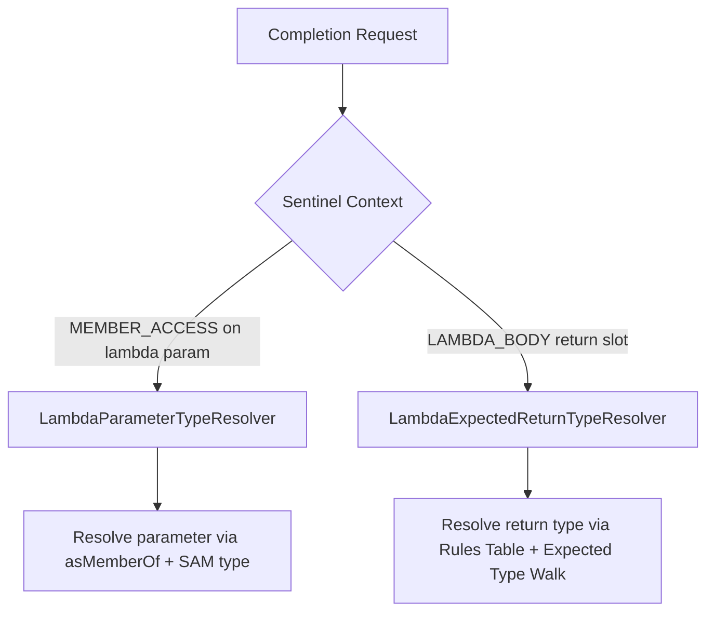

# Design Document: Lambda Expected Type and Parameter Completion

## 1. Problem Statement

When writing lambda expressions in Java, developers rely heavily on the IDE to infer types.
This is particularly important for:
- Autocomplete on implicitly-typed lambda parameters, e.g., `list.stream().map(s -> s.§)`.
- Autocomplete on return values of lambda bodies, e.g., `list.stream().map(s -> §).toList()`.

However, when type-checking incomplete or erroneous code, `javac`'s built-in type inference often fails.
It falls back to `Object` or `ERROR` types for intermediate nodes.
This prevents the editor from offering meaningful completion items.

---

## 2. Proposed Architecture

To solve this problem cleanly and robustly without introducing version-dependent compiler hacks, we split the resolution into two distinct, focused components.



### Component A: `LambdaParameterTypeResolver`
- **Purpose**: Infers the type of an implicitly-typed lambda parameter (e.g., `s` inside `s -> s.§`).
- **Mechanism**:
  1. Detects if the receiver is a variable declared as a lambda parameter.
  2. Resolves the target functional interface type of the enclosing lambda expression.
  3. Locates the Single Abstract Method (SAM) of the functional interface.
  4. Uses `javax.lang.model.util.Types#asMemberOf` to instantiate the SAM's signature in the context of the target type.
  5. Extracts the parameter type at the corresponding index and resolves wildcard bounds.

### Component B: `LambdaExpectedReturnTypeResolver`
- **Purpose**: Infers the expected return type of a lambda body (e.g., `§` inside `s -> §`).
- **Mechanism**:
  1. Uses a hybrid approach combining a declarative rules table with a dynamic AST walk-up.
  2. The rules table maps only methods introducing method-level type parameters for their return types.
  3. Class-level type parameters (e.g., `V` in `Map<K,V>.computeIfAbsent`) do not need rules because `javac` already resolves them from the receiver type declaration.
  4. Walks up the AST to resolve the target type from the enclosing variable declaration, assignment LHS, or method return statement.
  5. Safely propagates constraints backwards through the chain using public standard APIs.

---

## 3. Implementation Details

### A. Dynamic Target Type Walk-up
We walk the AST parent path to find where the expression result is consumed.
This is done using standard public APIs:

```java
private static TypeMirror enclosingExpectedType(
    final TreePath expressionPath, final AttributedFileAnalysis snapshot) {
  TreePath previous = expressionPath;
  for (TreePath current = expressionPath.getParentPath();
      current != null;
      current = current.getParentPath()) {
    final Tree leaf = current.getLeaf();

    if (leaf instanceof final VariableTree variable
        && variable.getInitializer() == previous.getLeaf()) {
      final Element el = snapshot.trees().getElement(current);
      return el != null ? el.asType() : null;
    }

    if (leaf instanceof final AssignmentTree assignment
        && assignment.getExpression() == previous.getLeaf()) {
      final TreePath lhsPath = new TreePath(current, assignment.getVariable());
      return snapshot.trees().getTypeMirror(lhsPath);
    }

    if (leaf instanceof final ReturnTree ret
        && ret.getExpression() == previous.getLeaf()) {
      return findEnclosingReturnTargetType(current, snapshot);
    }

    previous = current;
  }
  return null;
}
```

### B. Nested Lambda Returns
If a `ReturnTree` belongs to a lambda expression instead of a standard method, we recursively invoke the resolver to determine the expected return type of that lambda:

```java
private static TypeMirror findEnclosingReturnTargetType(
    final TreePath path, final AttributedFileAnalysis snapshot) {
  for (TreePath current = path.getParentPath();
      current != null;
      current = current.getParentPath()) {

    if (current.getLeaf() instanceof LambdaExpressionTree) {
      return resolve(current, snapshot).orElse(null);
    }

    if (current.getLeaf() instanceof MethodTree) {
      final Element el = snapshot.trees().getElement(current);
      return el instanceof final ExecutableElement exec ? exec.getReturnType() : null;
    }
  }
  return null;
}
```

### C. Rules Table Definition
We define common methods using a clean, declarative record structure:

```java
private record Rule(
    String ownerQualifiedName,
    String methodName,
    int lambdaArgumentIndex,
    ResultShape resultShape,
    Projection projection) {}
```

#### Result Shapes
- `INVOCATION_ITSELF`: For direct method mappings (e.g., `Optional.map`).
- `RECEIVER_OF_TOLIST`: For chains ending with `.toList()`.
- `RECEIVER_OF_COLLECT`: For chains ending with `.collect(...)`.

#### Projections
- `FIRST_TYPE_ARGUMENT`: Extracting `T` from `List<T>` or `Set<T>`.
- `MAP_VALUE_TYPE`: Extracting `V` from `Map<K, V>`.
- `MAP_VALUE_FIRST_TYPE_ARGUMENT`: Extracting `T` from `Map<K, List<T>>` (for `groupingBy` collectors).

#### Standard Library Coverage List
We map only methods that introduce method-level type variables for their return types:
1. **`java.util.Optional`**:
   - `map` (returns `Optional<U>`, projects `U`)
   - `flatMap` (returns `Optional<U>`, projects `U`)
2. **`java.util.stream.Stream`** (and primitive streams mapping to objects):
   - `map` (returns `Stream<R>`, projects `R`)
   - `flatMap` (returns `Stream<R>`, projects `R`)
   - `mapToObj` (returns `Stream<U>`, projects `U`)
3. **`java.util.concurrent.CompletionStage`** (and `CompletableFuture` subclass):
   - `thenApply` / `thenApplyAsync` (returns `CompletionStage<U>`, projects `U`)
   - `thenCompose` / `thenComposeAsync` (returns `CompletionStage<U>`, projects `U`)
   - `handle` / `handleAsync` (returns `CompletionStage<U>`, projects `U`)
   - `exceptionally` (returns `CompletionStage<T>`, projects `T`)

---

## 4. Test Plan

We will add tests verifying correct resolution for both components:

1. **Parameter Type Resolution**:
   - Verify that autocompleting `s.` inside `Stream.of("").map(s -> s.§)` correctly offers `String` members.
   - Verify that autocompleting `entry.` inside `map.entrySet().stream().map(entry -> entry.§)` correctly offers `Map.Entry` members.
2. **Lambda Return Type Resolution**:
   - Verify return type inference for `List<String> out = list.stream().map(s -> §).toList()`.
   - Verify return type inference for `Set<String> out = list.stream().map(s -> §).collect(Collectors.toSet())`.
   - Verify return type inference for `Map<String, List<Integer>> out = list.stream().map(s -> §).collect(Collectors.groupingBy(...))`.
   - Verify return type inference for `List<String> foo() { return list.stream().map(s -> §).toList(); }`.
   - Verify return type inference for nested lambda blocks:
     ```java
     List<String> out = list.stream().map(s -> {
       return §;
     }).toList();
     ```
